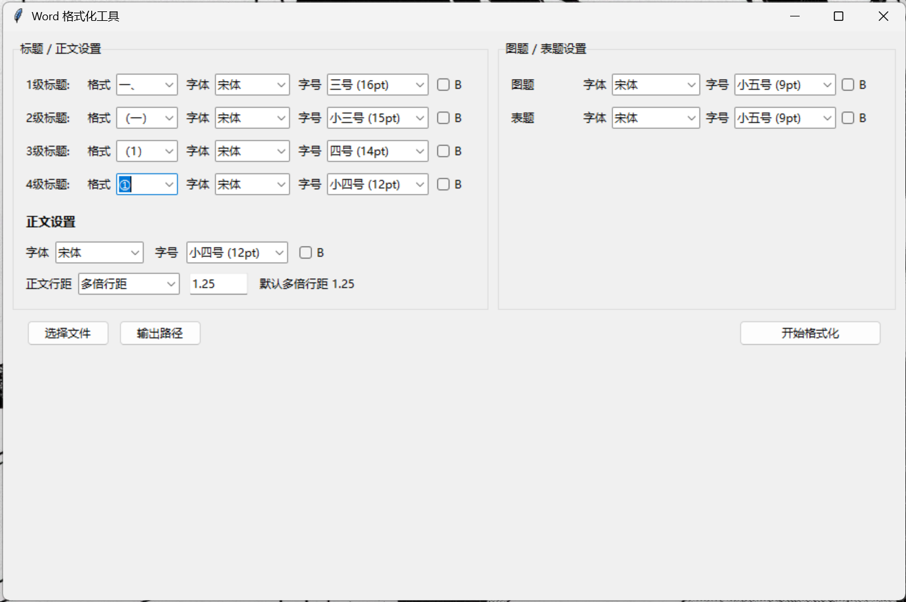

# WordFormatter —— Word 一键规范化排版桌面工具

**WordFormatter** 是一款用于 **自动整理 Word 文档标题编号与段落格式** 的桌面工具。  

## ✨具体点的功能：
1.根据用户设置的标题的格式（例如 1. （一））,识别每级标题和正文，并应用用户规定的字体,字号与是否加粗.

能够将用户手打的**文本编号**或者word中的**自动编号列表**转化为word中**内置的标题格式**，方便用户生成目录。

额外的会将图题和表题居中处理

2.具备段落统一缩进的功能，会将所有的段落都顶格，并首行缩进两格
所有的标题也会左对齐

3.针对`(`的中英文格式，会被统一中文格式下的`（`

4，目前支持可选的字体有"宋体", "黑体", "微软雅黑", "楷体","等线"
支持的字号有  小三号，三号，小四号，四号，小五号，五号。

---



---
# 怎么使用


[WordFormatter v2.0.0 Release](https://github.com/moon-like-gray-cat/WordFormatter/releases/tag/v2.0.0)
只需要下载 .exe 后缀的文件即可

---

## ⚠ 使用前请注意

### 0.固定行距问题
如果正文的行距是固定的磅值，会压缩图片的显示空间。简单来说就是图片显示不全
非必要不要设置固定行距，不然只能自己手动调整行距的设置了（先全选中设置为一倍行距，这个时候图片会恢复正常，之后再单独选中文字，设置行间距）

### 1. 文件格式必须是 `.docx`
`.doc` 无法处理，请先另存或转换。


### 2. 段落必须使用“硬回车（↵）”
请确保段落都是按 **Enter** 换行的硬回车（↵），而不是 Shift+Enter 的软回车（↓）。

### 3. 编号必须单独成段

因为程序通过“段落前缀识别编号”，所以标题编号不能与正文混在一行。
如果（1）是您规定的标题之一

正常示例：
```angular2html
(1)标题
text
(2)标题
text
```

错误示范
```angular2html
(1)text text text (2)text
```
只会识别（1），text(2)text 都会当作(1)的标题

### 4. 注意正文开头不要出现可能被识别的编号

如果你的编号使用了：  
`一` `1` `a` 等常见字符，

请避免正文段落以这些字符开头，否则可能被判断为标题编号。


---

## 代码的结构和简单说明

```
项目的结构
WordFormatter/
│
├── src/                         # <--- 核心目录
│   └── wordtool/                # 项目包名（import wordtool）
│       ├── __init__.py
│       │
│       ├── app/                 # GUI 层
│       │   ├── __init__.py
│       │   ├── main.py        # 启动GUI
│       │   ├── ui_components.py # 界面布局文件  所有 Tkinter 的 Frame、Label、Entry、Combobox 都写在这里。 
│       │   └── event_handlers.py  # 处理按钮事件
│       │
│       ├── core/                # 业务代码（Word 处理逻辑）
│       │   ├── __init__.py
│       │   ├── formatter.py
│       │
│       ├── resources/           # 图标、样例文件
│       │   ├── icon.ico
│       │   └── ui_config.json
│       │
│       └── config.py
│
├── tests/                       # 单元测试
│ 
│
├── scripts/                     #打包脚本
│   └── build_exe.bat
│
├── pyproject.toml               # 现代项目管理（替代 setup.py）
├── README.md
└── run.py                       # 程序入口，用于启动 GUI


```


